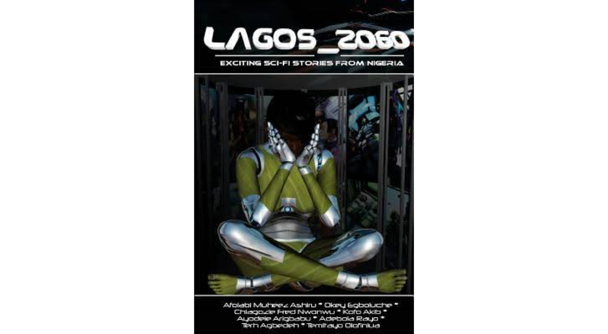

```{r setup, include=FALSE}
knitr::opts_chunk$set(echo = FALSE)
library(ggplot2)
library(dplyr)
library(RColorBrewer)
library(reshape2)
library(fmsb)
library(png)
library(grid)

##Check working directory where the data file is placed
getwd()

##Read and transform data
sc<-read.csv("Scientists.csv", header = TRUE, skip = 1)

#Change to lower case
sc$Scientist.s.Intention<-tolower(as.character(sc$Scientist.s.Intention))
sc$Outcome.of.Research<-tolower(as.character(sc$Outcome.of.Research))
sc$Quits.science<-tolower(as.character(sc$Quits.science))
sc$Nigerian.Residency<-tolower(as.character(sc$Nigerian.Residency))
sc$Source.Title<-tolower(as.character(sc$Source.Title))


#Create a new science field column which is ordered by freq
sc_field <- table(sc$Char.Field)
field_levels <- names(sc_field)[order(sc_field)]
field_levels<-c("Unspecified","Robotics","Env. Science","Genetics","Medicine","Virology","Energy","Engineering","Space") 
sc$Field_Ord <- factor(sc$Char.Field, levels = field_levels)


#Create a new field determining if a scientist lives in nigeria
sc$Char.Country<-tolower(as.character(sc$Char.Country))
unique(sc$Char.Country)
sc$Char.Residency<-sc$Char.Country
sc$Char.Residency[sc$Char.Residency=="nigeria"]<-"yes"
sc$Char.Residency[sc$Char.Residency!="yes"]<-"no"
unique(sc$Char.Residency)


# Multiple plot function
#
# ggplot objects can be passed in ..., or to plotlist (as a list of ggplot objects)
# - cols:   Number of columns in layout
# - layout: A matrix specifying the layout. If present, 'cols' is ignored.
#
# If the layout is something like matrix(c(1,2,3,3), nrow=2, byrow=TRUE),
# then plot 1 will go in the upper left, 2 will go in the upper right, and
# 3 will go all the way across the bottom.
#
multiplot <- function(..., plotlist=NULL, file, cols=1, layout=NULL) {
        library(grid)
        
        # Make a list from the ... arguments and plotlist
        plots <- c(list(...), plotlist)
        
        numPlots = length(plots)
        
        # If layout is NULL, then use 'cols' to determine layout
        if (is.null(layout)) {
                # Make the panel
                # ncol: Number of columns of plots
                # nrow: Number of rows needed, calculated from # of cols
                layout <- matrix(seq(1, cols * ceiling(numPlots/cols)),
                                 ncol = cols, nrow = ceiling(numPlots/cols))
        }
        
        if (numPlots==1) {
                print(plots[[1]])
                
        } else {
                # Set up the page
                grid.newpage()
                pushViewport(viewport(layout = grid.layout(nrow(layout), ncol(layout))))
                
                # Make each plot, in the correct location
                for (i in 1:numPlots) {
                        # Get the i,j matrix positions of the regions that contain this subplot
                        matchidx <- as.data.frame(which(layout == i, arr.ind = TRUE))
                        
                        print(plots[[i]], vp = viewport(layout.pos.row = matchidx$row,
                                                        layout.pos.col = matchidx$col))
                }
        }
}

```
# Abstract

Science fiction is a recent genre classification in Nigerian literature. Currently, there is only a limited body of work available in English, but it has been growing steadily since 2000. African literature tends to be analyzed from the perspectives of race and ethnicity, (post)colonialism and globalisation. However, I am more interested in the role that science-fiction could play in the conversation about science and scientists. Canonical works from North American and European authors have been considered in this way, but to my knowledge little has been done to interrogate the narratives around science in Nigerian literature. In particular, the figure of the scientist has been examined extensively in Western literature, but not in Nigerian science fiction. The most recent research indicates that long-enduring stereotypes are finally being eroded. The representations of scientists in contemporary fiction do not fit as easily into a typology as they did prior to the 21st century (Haynes 1993, 2003, 2016). This study identifies and characterises a sample of scientist figures in Nigerian science fiction, and examines them in relation to archetypes in Western literature. 

### *This is an abridged online version.*

# Research questions

* What kind of generalizations can be made about representation of scientists in Nigerian Sci-Fi?
* Considering the portraits of scientists, what can be said about the discourse on science?
    + On gender?
    + On technology?  
    

```{r fig.width=2}

img <- readPNG("Lagoon.png")
grid.raster(img)
 
```
```{r fig.width=2, fig.height=3}

img <- readPNG("Phoenix.png")
grid.raster(img)
 
```
```{r fig.width=2, fig.height=3,echo=FALSE}

img <- readPNG("Rosewater.png")
grid.raster(img)

```
```{r fig.width=2, fig.height=3,echo=FALSE}

img <- readPNG("AfroSF.png")
grid.raster(img)

```
```{r fig.width=2, fig.height=3,echo=FALSE}

img <- readPNG("AfroSF2.png")
grid.raster(img)

```
```{r fig.width=2, fig.height=3,echo=FALSE}

img <- readPNG("NigeriansInSpace.png")
grid.raster(img)

```


# Introduction

It is not widely known that Nigerian science fiction (Nigerian SF) exists, and so one of the first tasks of this thesis is to identify a corresponding body of literature. This requires qualifying the terms ‘Nigerian’ and ‘science fiction’. For this thesis, the term ‘Nigerian’ refers to the author and includes both residents of Nigeria and members of the diaspora. 

### Who is a Nigerian author?

All the authors represented in this thesis are either Nigerian citizens or first-generation Nigerians living in the diaspora who maintain links with Nigerian cultural life. 

Interestingly, the proportion of authors living in Nigeria is very similar to the proportion of characters who are also Nigerian residents.

```{r resid, fig.height= 3}
sc_a<-sc[!duplicated(sc$Auth.Name),]

p1<-ggplot(sc_a, aes(Nigerian.Residency))+geom_bar(fill = c("orange","dark green"))+
        ggtitle("Author's residency in Nigeria") +
        theme(axis.title.x=element_blank(), legend.title=element_blank())+ #no title on x axis or legend
        #ylim(0,40)+
        ylab("Number of authors")+ 
        theme(legend.position="none")

p2<-ggplot(sc, aes(Char.Residency))+geom_bar(fill = c("orange","dark green"))+
        ggtitle("Character's residency in Nigeria") +
        theme(axis.title.x=element_blank(), legend.title=element_blank())+ #no title on x axis or legend
        ylab("Number of scientists")+ 
        theme(legend.position="none")#no legend
        
multiplot(p1, p2, cols=2)

```

However, most of the characters who are in exile are written by the authors who themselves live abroad.
Writers who live in Nigeria tend to imagine their scientist characters living there too.

```{r resid2, fig.height= 4}

df<-data.frame(sc$Nigerian.Residency,sc$Char.Residency)
names(df)<-c("author", "character")

p<-ggplot(df, aes(author, ..count..)) + geom_bar(aes (fill = character), position = "dodge")+
        ggtitle("Living in Nigeria?") +
        ylab("Number of scientists")+ 
        xlab("Authors")+theme(legend.position="bottom")+
        scale_fill_manual(values=c("orange","dark green"), name="Characters")
       
print(p)

```


### What is considered science fiction?

For the second term, ‘science fiction’, I am relying on the publishing industry’s definition, using those literary sources that are marketed as ‘science fiction’. Comic books, graphic novels, art, film or science fiction sources in the media other than the written word are excluded from the analysis.

The immediate consequence of defining Nigerian SF in this way is to narrow a list of eligible publications, enabling a survey of a large proportion of relevant works, both in paper or purely digital formats. The objective of this survey was to identify scientist characters. The works that don’t contain scientists are not discussed. 

### List of works analysed

Identifying literary sources containing scientists is a time-consuming task. For this aspect of research, social media proved valuable, in particular, the ‘African Science Fiction and Fantasy’ Facebook group, which brings together many African writers and academics.

Online African literary communities such as BrittlePaper, Omenana, Chimurenga, Sabara and Jalada all publish science fiction, but only a small proportion of those are by Nigerian authors that contain relevant characters. The difficulty was sorting through a lot of material, discovering if the author was Nigerian, if the genre was identified as science fiction and, finally, if it contained sufficiently interesting characters who are scientists. Some of the characters were omitted if they bore little relevance to the discourse about science or scientists.

The sources considered for this analysis are listed in the table below. 

```{r sources}
library(knitr)
sc_s<-sc[!duplicated(sc$Source.Title),]
xt<-cbind(as.character(sc_s$Auth.Name), toupper(sc_s$Source.Title))
colnames(xt)<-c("Author","Title")
kable(xt)
```

Based on the works above, a database of scientist characters was constructed. It is available on [GitHub](https://github.com/pl202/NigerianSF), along with the code for this analysis in [R studio](https://www.rstudio.com/). 


### Many of the scientist characters come from a single collection 
 

### Why study representations of scientists?

Representations of scientists in fiction and film are of interest in their own right, as components of literature. However, research into representation of science and scientists may be motivated by policy questions. 

Researchers generally agree that fictional representations can draw critical attention to issues that are neglected in society. For example, Kurzinger et al. (2009) meta-analysis reveals a tendency of science fiction to ‘foreground questions of distribution, democracy and accountability’, and to highlight unpredictability of research, producing scenarios where control of science and technology is elusive. In explaining a motivation for her seminal study ‘From Faust to Strangelove: representations of the Scientist in Western Literature’ Roslynn D. Haynes offers the view that ‘writers are reflecting more or less faithfully the attitudes of their society towards actual science and scientists’ (p. 5).

```{r fig.width=2, fig.height=3,echo=FALSE}

img <- readPNG("Haynes.png")
grid.raster(img)

```

The evidence from recent studies supports both hypotheses: that fiction can be an indicator of public attitudes and a stronger assumption that the public is influenced by fictional representations in literature. 

# Analysis of scientist characters

Most scientist characters in Nigerian SF are identified with a specific field of research. Here, research is divided into eight academic fields: energy research, engineering, environmental science, genetics, medicine, robotics, space time travel, and virology. These categories are selected to capture the diversity of scientists in specific enough detail, without creating too many subgroups. Space-time is the most popular specialisation.  

```{r field}
sc_field <- table(sc$Char.Field)
field_levels <- names(sc_field)[order(sc_field)]
field_levels<-c("Unspecified","Robotics","Env. Science","Genetics","Medicine","Virology","Energy","Engineering","Space") 
sc$Field_Ord <- factor(sc$Char.Field, levels = field_levels)

p1<-ggplot(sc, aes(Field_Ord,fill = Field_Ord))+geom_bar()+ggtitle("Field of research") +
        theme(axis.title.x=element_blank(), legend.title=element_blank())+ #no title on x axis or legend
        theme(legend.position="bottom")+
        ylim(0,13)+
        ylab("Number of scientists")+
        scale_fill_manual(values=c("#CCCCCC","#666699","#66CC66","#66CC66", "#66CC66","#66CC66","#666699","#666699","#666699"), name="Faculty",
                          breaks=c("Unspecified","Env. Science", "Energy"),
                       labels=c("Unspecified", "Natural Science", "Technology"))


print(p1)

```

The focus on area of expertise and gender is the basis for the analysis of representations of scientists in Western literature, where Haynes (1994, 2016) shows that specialisation and gender correlate with fictional representation patterns. Looking at a historical dimension in Western literature, natural scientists tended to be ‘complimentary to the point of eulogy’ in the 19th century and commonly afterwards (Haynes 1994, p. 109). After the Second World War the portraits of physicists, biologists and chemists became tainted due to association with military uses, such as nuclear, biological and chemical weapons, while the portraits of astronomers remained largely positive (Haynes 1994, 276). 

## Gender

One of the first things which stands out from the data is the gender imbalance. Women are underreprested both amongst the authors and the amongst the scientist characters.

### Where are the female scientists? 

Female Nigerian SF writers are also a minority.

```{r gender, fig.height= 3, fig.width= 6}
##Sex of the character
g1<-ggplot(sc, aes(Char.Sex, fill = Char.Sex))+geom_bar()+ggtitle("Character's Gender") +
        theme(axis.title.x=element_blank(), legend.title=element_blank())+ #no title on x axis or legend
        ylim(0,40)+
        ylab("Number of scientist characters")+ 
        theme(legend.position="none")#no legend
        

#duplicated(sc$Auth.Name)
sc_a<-sc[!duplicated(sc$Auth.Name),]
#str(sc_a)
#head(sc_a)
g2<-ggplot(sc_a, aes(Auth.Sex, fill = Auth.Sex))+geom_bar()+ggtitle("Author's Gender")+
        theme(axis.title.x=element_blank(), legend.title=element_blank())+ #no title on x axis or legend
        ylim(0,15)+
        ylab("Number of writers")+ 
        theme(legend.position="none")#no legend
#print(g2)

multiplot(g1, g2, cols=2)
```

The two questions are related, as male authors are much more likely write male scientists.

### The influence of author's gender 

Female writers, in this analysis, are more likely to have female scientist characters in their fiction. Female authors were also found to be more likely to depict women as scientists in Western SF (Merrick 2012).

```{r gender2, fig.height= 3, fig.width= 6}
sc_f<-sc[sc$Auth.Sex=="Female",]
p1<-ggplot(sc_f, aes(Char.Sex, fill = Char.Sex))+geom_bar()+ggtitle("By a Female Author") +
        theme(axis.title.x=element_blank(), legend.title=element_blank())+ #no title on x axis or legend
        ylab("Number of scientist characters")+ 
        theme(legend.position="none")


sc_m<-sc[sc$Auth.Sex=="Male",]
p2<-ggplot(sc_m, aes(Char.Sex, fill = Char.Sex))+geom_bar()+ggtitle("By a Male Author") +
        theme(axis.title.x=element_blank(), legend.title=element_blank())+ #no title on x axis or legend
        ylab("Number of scientist characters")+ 
        theme(legend.position="none")
multiplot(p1, p2, cols=2)

```

About half of the female scientists are part of a romance narrative, involving courtship or early stages of marriage. All female scientists are described as physically attractive. At some point in all of the narratives containing a female scientist, she appears as a young woman - whereas the majority of male scientists are presented as middle-aged. 

### Age of the scientist as a function of gender

```{r age, fig.height= 3, fig.width= 6}
sc_f<-sc[sc$Char.Sex=="Female",]
p1<-ggplot(sc_f, aes(Char.Age, fill = Char.Age))+geom_bar()+ggtitle("Female Scientist's Age") +
        theme(axis.title.x=element_blank(), legend.title=element_blank())+ #no title on x axis or legend
        scale_fill_brewer(palette="Spectral")+
        ylab("Number of scientists")+ 
        theme(legend.position="none")


sc_m<-sc[sc$Char.Sex=="Male",]
p2<-ggplot(sc_m, aes(Char.Age, fill = Char.Age))+geom_bar()+ggtitle("Male Scientist's Age") +
        theme(axis.title.x=element_blank(), legend.title=element_blank())+ #no title on x axis or legend
        scale_fill_brewer(palette="Spectral")+
        ylab("Number of scientists")+ 
        theme(legend.position="none")

multiplot(p1, p2, cols=2)

```

So indispensible is the appearance for female scientists in Nigerian SF, that there is even a character who turns to science solely out of fear of losing her legendary beauty. Evelyn McDuffie (‘Deletion’) discovers a way to prolong youth, but her achievement is stigmatized: she amasses a business empire that turns politically corrupt, and her research is rumored to be linked to a new and deadly virus that starts to decimate the population.

One of the female characters – Rekia (‘Mango Republic’) - is a scientist but her research is so marginal to the story, there is no hint of what she does. Instead, the story focuses on her role as the wife of the protagonist Aromire, and as a mother-to-be of his child. By contrast, Aromire’s many achievements as a scientist are named and valorized. Rekia suffers seven miscarriages while working as a scientist; she pleads for her husband’s permission to leave work, because the doctor has assured her that she will succeed in carrying to term only if she becomes a housewife. This story imagines that in 2060 it is still the norm for all important family decisions to be made by men.

The incompatibility between the goal of motherhood and aspirations of being a scientist is a persistent theme through all the narratives in Nigerian SF. Out of all female scientists, only Adaora (‘Lagoon’) has children, and as the novel progresses they are taken away from her by her husband as a matter of safety – success in her role as a scientist coincides with failure to protect her children.

Bumi’s (‘The Book of Phoenix’) monstrousness as a scientist is based largely on her depiction as an abusive mother to an orphan girl Phoenix whom Bumi helps to genetically engineer. Bumi abuses Phoenix both physically and psychologically, subjecting her to painful experiments. Phoenix escapes the ‘secure’ American government laboratory, but her childhood trauma makes her an uncontrollable, apocalyptic weapon.

Many male scientists in Nigerian SF have children, and the conflict between their careers and fatherhood is not explicitly part of any narrative. When Wale Olufumni in ‘Nigerians in Space’ goes into exile, hiding from government-backed gangsters, he still gets to raise his son Dayo (after kidnapping him from his mother).  

Nevertheless, most of the female scientists possess inspiring character features. Adaora, in particular, is smart, brave and independent – a woman who stands up to her husband, the army, the president, the church and even the aliens. DevilDog defies the establishment, Oyin Da - the government, Violet defies a corporation, while Tara helps brings a corporation down. 

However, these characters don’t feel particularly committed to science – nearly half of the female scientists quit science in the various narratives. 


### Women are represented as quiters

```{r quit, fig.height= 4, fig.width= 4}
df<-as.data.frame(table(sc$Quits.science, sc$Char.Sex))
colnames(df)<-c("Quits","Gender","Freq")

##Propensity to quit science by gender
p2<-ggplot(df, aes(x=Gender, y = Freq, fill=Quits))+
        geom_bar(stat="identity")+ theme(axis.title.x=element_blank())+
        ggtitle("Propensity to Quit")+
        ylim(0,40)+ylab("Number of scientists")+
        scale_fill_manual(values=c("black", "orange"))+
        theme(axis.title.y = element_blank())
        
print(p2)

```

### Women and ‘mother nature’

Three of the female scientists are identified with nature through their work in the field of environmental science (Adaora, Yinka, Tara), as women are associated with ‘mother nature’ in many cultures. In fact, there are no male scientists in the field – Wale Olufumni (‘Nigerians in Space’) is a geologist, but he is a lunar geologist and his scientific interests are mostly to do with space exploration. 
So, while female scientists protect nature, prolong beauty, give birth and get married, male scientists conjure new ways to produce energy, build robots and invent space-time travel. 

```{r field_gender}
df<-as.data.frame(table(sc$Char.Sex, sc$Field_Ord))
colnames(df)<-c("Gender","Field","Freq")

g<-ggplot(df, aes(x=Field, y = Freq, fill=Gender))+
        geom_bar(stat="identity")+theme(legend.position="bottom")+
        ggtitle("Research Field and Gender")+ ylim(0,13)
print(g)

```

# Narrative Themes

Scientists’ research in Nigerian SF is always politicised, especially in the areas of energy, genetics and robotics. This is likely due to the heightened attention in Nigeria to oil, ethnicity and unemployment. Nigeria, which had 45 million people at independence in 1960, has approximately 190 million people now and is projected to grow to 400 million by 2050 to become the world’s third most populous country, after India and China. It is not surprising then that Nigerian SF writers are anxious about governing the country in a future that is under threat from climate change, regionalism and technologies which eliminate jobs while the population grows rapidly.

Scientists in Nigerian SF are frequently presented as well intentioned, but their efforts are compromised by the system. 

```{r intentions}
df<-as.data.frame(table(sc$Scientist.s.Intention, sc$Field_Ord))
colnames(df)<-c("Intentions","Field","Freq")

g<-ggplot(df, aes(x=Field, y = Freq, fill=Intentions))+
        geom_bar(stat="identity")+ theme(axis.title.x=element_blank())+
        ggtitle("Research Field and Scientist's Intentions")+
        scale_fill_manual(values=c("#FFCC33", "#666666", "#66CC99"))+
        ylim(0,13)+theme(legend.position="bottom")+
        theme(axis.title.x=element_blank(), legend.title=element_blank()) #no title on x axis or legend
       

print(g)
```

Despite mostly good intentions, the scientists are often left without agency or control over their inventions – in Nigerian SF, they are frequently victimized. The governments have the prime responsibility for mostly dystopian futures depicted in Nigerian SF, except in the ‘Amphibian Attack’ and the ‘Lagoon’ narratives, where elected politicians are outwitted and overpowered by corporations and the aliens, respectively. 

The powers are corrupting or derailing science in almost every Nigerian SF, and nowhere is the pessimism over science’s ability to deliver ‘progress’ expressed more directly than in ‘The Book of Phoenix’, p. 98, where the protagonist Phoenix is justifying destroying all the centres of science, housed in in seven towers located all over the world, with the scientists still in them:


> Behind the good intentions and amazing science, however, was abomination. Weapons, the quest for immortality, how far could we go… The foundation of all the towers was always always always corrupt, driven by a lusty greed. 

> To kill a snake, cut off the head.

### Genetics 
There are perhaps too few geneticists in the sample to make generalizations, but genetic manipulation is associated with the most objectionable research and characters. One of the three geneticists, Violet, quits science rather than pursue unethical research; she trades ‘unnatural’ biogenetics for ‘natural’ farming (Terra Incognita, p. 177):

> Anyway, the company wants to figure out a way to track and identify these people [with super human abilities], and they want to use our bio-genetic research to do it. Well, I told them to go fuck themselves, so they put me on indefinite suspension. With pay, of course. Ola and I bought the Yangs’ old farm.

Bumi in ‘The Book of Phoenix’ uses genetic research to track and identify humans with special abilities, and so does Mathew Halliday in ‘Ofe!’ - this is a strange coincidence. Surveillance is a strong theme in all three plots involving geneticists in Nigerian SF. In ‘The Book of Phoenix’ it is not just Bumi who is trying to keep track of her creation, it is ‘All of THEM, the “Big Eye” – the Tower 7 scientists, lab assistants, lab technicians, doctors, administrative workers, guards, and police.’ Phoenix, who was genetically engineered in Tower 7, recounts that everyone who worked in the tower watched the ‘speciMen’ all the time. Their attempted total surveillance and control inevitably failed, but their complicity justified in the mind of Phoenix their total extermination. 

In ‘Ofe!’ another geneticist willing to conduct gruesome experiments on living human beings, Mathew Halliday, has used his research to survey the entire population of West Africa and to identify 13 individuals carrying alien genes that endow them with superhuman abilities. He manages to trap them in order to experiment on them, but they fight back and escape. 
	
	
These similarities in the plots must speak to specific fears about genetics as knowledge that enables discrimination against people based on their genetic makeup, rather than on the basis of their character or actions. In Nigerian SF, genetics research is associated with enabling the government with new technologies of control and surveillance. 

### Robotics and unemployment 

Robotics, like genetics, are the kinds of technologies that are associated with surveillance. In Nigerian SF too we find many instances of various types of drones snooping and relaying information to governments. However, we don’t find the scientists preoccupied with developing robotics for this purpose. They are developing robots to replace people, making humans superfluous as labourers, and as lovers.  Although robots are nearly ubiquitous in Nigerian SF, there are only two scientists which predominantly build robots, both found in the Lagos_2060 collection of short stories. 

### Energy and the failure of progress 

Working on developing alternative sources of energy invariably leads to tragedy for the scientists in Nigerian SF. Nigeria’s crippling dependence on oil does not end happily as alternative sources of energy are invented. An unnamed scientist in ‘An Indigo Song for Paradise’ announcing free and unlimited source of energy, declares hopefully (AfroSF2, p. 437):

> ‘This is the end of all our problems,’ a man was saying loudly to a group of listeners. ‘With free energy finally within our grasp, we will easily tackle all other problems facing society. […] I predict a great change in society, ladies and gentlemen, now that we have crossed this scientific thresh-hold. In fact, I will go so far as to say today heralds the end of wars and all forms of crime and violence. […] With the end of war, comes the end of the economy. No more shall he con me, that masked devil known as capitalism. No longer!’

No sooner has he finished his speech than an armed gang bursts into the conference killing the speaker, and turning the university into a war zone. In fact, the whole city succumbs to an apocalypse shortly after. 

Both scientists working on alternative energy sources in ‘Nigerians in Space’ are murdered by the corrupt government outfit whose power is welded to oil-dependence. 

In the two remaining narratives featuring energy scientists, the invention of cheap energy alternatives to oil leads to the break-up of Nigeria, with dire consequences outside of Lagos. Ravi Shukhavati in ‘Cold Fusion’ (Lagos_2060) figures out how to produce energy cheaply. The Lagos State Government acquires rights to the technology, enriching itself and seeking to rule the rest of Nigeria, nearly sparking another war between regions. The scientist himself does not fare well – he is pursued for his knowledge by assassins and kidnappers. We learn that he has gone into hiding and lives in constant fear.

### Medicine and engineering
The majority of scientists in Nigerian SF are driven by a utopian impulse but almost never does their research actually benefit humanity. Medical scientists are either murdered by the state which resists modernisation, like Mohamed Farai in ‘Nigerians in Space’, or have their research subverted by powerful interests in a way that makes humanity distinctly worse off. For example, an unnamed scientist in ‘Annihilation’ (Lagos_2060) creates a cure for cancer, but instead of lifting the burden of a disease his invention leads to a widespread drug epidemic and, even more devastating to society, a ‘war on drugs’. Evelyn McDuffie’s medical breakthrough on prolonging youth and increasing longevity create stark social divisions between those who can afford the medical treatment and those who cannot. 

Engineers have a greater variety of fates than any other category of fictional scientists in Nigerian SF. 

### Space-time travel

Governments are the main problem for scientists in Nigerian SF who want to travel to a different time or universe. Several are imprisoned, interrogated, tortured and killed by fictional Nigerian governments: Wale Olufumni, Dr. Emalaba, Dr. Kehinde Abaseki, and Prof. Aloy Ogene. With exceptions of ‘The Bicycle Girl’ and a follow-up novel ‘Rosewater’, those who discover time travel don’t actually get to undertake the journey. 

### Virology 

The field of virology has both the scientists who make viruses and those who fight them. Dr. Chris Yadua (‘Deletion’) creates a cure for the deletion-virus, working secretly from the government which seems to condone the epidemic. De Sampa (‘Minority Report’) is a virologist whom the world only recognizes as a priest - for many decades he uses his scientific knowledge to exercise power over a rural community. When he dies the virus escapes and spreads to become an epidemic. Dr. Dafe and Dr. Duke (‘Minority Report’) put a stop to it, but no one believes them when they claim the virus was engineered by De Sampa. 

Another virologist, Mr. Adam (‘Notes from Gethsemane’) creates a virus targeting an invasive alien entity. Virologists, in the sampled Nigerian SF stories, are all discussed in the context of biological weapons. Interestingly, they are all dealing with viruses that are engineered rather than naturally occurring.


### Scientists are presented mostly as failing to improve human condition 

```{r impact}
df<-as.data.frame(table(sc$Outcome.of.Research, sc$Field_Ord))
colnames(df)<-c("Outcome","Field","Freq")

g<-ggplot(df, aes(x=Field, y = Freq, fill=Outcome))+
        geom_bar(stat="identity")+ theme(axis.title.x=element_blank())+
        ggtitle("Research Field and Research Implications for the World")+
        scale_fill_manual(values=c("#FFCC33", "#66CC99","#666666","grey"))+
        ylim(0,13)+theme(legend.position="bottom")+
        theme(axis.title.x=element_blank(), legend.title=element_blank()) #no title on x axis or legend
        

print(g)
```

# Relationship to Western SF

### Gender, age, sexuality
Compared with Western SF in the 21st century, portrayals of women scientists in Nigerian SF are more problematic, reflecting a greater degree of patriarchy and sexism in that society. However, the directions of the biases are similar: writing women characters who are young and attractive, positioning female scientists in romantic roles but rarely depicting them as mothers (Merrick 2012). In Western SF there are many recent literary depictions of female scientists that actively resist gender stereotypes, a process that Merrick (2012) documents. Exceptions are becoming norms. Western SF literature of the 21st century contains portrayals of women participating in the full range of sciences, of varying ages and appearances, in positions of authority, able to balance their passion for science with motherhood, and living and working in non-sexist environments (Merrick 2012). I was not able to find equivalent representations of female scientists in Nigerian SF. 

Unlike Western SF, there are no female homosexual scientist characters in Nigerian SF. There is one male homosexual scientist in ‘Nigerians in Space’, when we encounter him in the text he has already been assassinated but he is presented positively through the recollections of his Parisian neighbour.

### Common ideas in Western SF: limits to knowledge, longevity, aliens

One idea that is prominent in Western portraits of scientists is ‘playing God’, or transgressing against some ‘natural’ limits to knowledge (Haynes 1994, Ball 2012). These ideas are present in connection to scientist characters in the following texts: ‘Lagoon’, ‘The Book of Phoenix’, ‘Notes from Gethsemane’, and ‘An indigo song for paradise’. 

Another common preoccupation in Western literature connected to science is increased longevity or a possibility of eternal life (Haynes 1994). This theme appears in ‘Lagoon’, ‘The Book of Phoenix’, ‘Notes from Gethsemane’, ‘An Indigo Song for Paradise’ and the story ‘Deletion’.

Extra-terrestrial aliens is another hallmark of Western SF, and we find them also in ‘Lagoon’, ‘The Book of Phoenix’, ‘Notes from Gethsemane’, ‘Rosewater’, ‘An Indigo Song for Paradise’ and ‘Ofe!’. There is no specific reason to consider these three themes particularly ‘Western’. However, it is worth noticing that these themes not only tend to appear together in the same texts but are almost exclusively written by diaspora writers.

```{r themes, fig.height= 5}

##Which themes are covered by authors who live in Nigeria?
sc_s<-sc[!duplicated(sc$Source.Title),]
theme<-select(sc_s, Nigerian.Residency, Limits.to.Knowledge:Outside.Infl)
theme1<-theme[theme$Nigerian.Residency=="yes",]
theme1<-theme1[,2:9]
count_yes<- function(x) length(x[x=="yes"])
counted_themes1<-array()
for (i in 1:8)
{
        theme1[,i]<-tolower(as.character(theme1[,i]))
        counted_themes1[i]<-count_yes(theme1[,i])
}
names(counted_themes1)<-c("Limits to Knowledge", "Eternal Life", "Health", "Aliens", "Religion", "Government", "Capitalism", "Neo-Colonialism")
counted_themes1<-as.data.frame(t(counted_themes1))
counted_themes_N=rbind(rep(14,8),rep(0,8), counted_themes1)

##Which themes are covered by authors who live outside Nigeria?
theme2<-theme[theme$Nigerian.Residency=="no",]
theme2<-theme2[,2:9]
counted_themes2<-array()
for (i in 1:8)
{
        theme2[,i]<-tolower(as.character(theme2[,i]))
        counted_themes2[i]<-count_yes(theme2[,i])
}
names(counted_themes2)<-c("Limits to Knowledge", "Eternal Life", "Health", "Aliens", "Religion", "Government", "Capitalism", "Neo-Colonialism")
counted_themes2<-as.data.frame(t(counted_themes2))
counted_themes_Ex =rbind(rep(9,8),rep(0,8), counted_themes2)


counted_themes<-rbind(counted_themes_N,counted_themes_Ex[3,])
rownames(counted_themes)<-c("Max","Min","Nigeria","Diaspora")


# Together
colors_border=c( rgb(0.2,0.5,0.5,0.9), rgb(0.7,0.5,0.1,0.9) )
colors_in=c( rgb(0.2,0.5,0.5,0.4), rgb(0.7,0.5,0.1,0.4) )
radarchart(counted_themes, axistype=1 , 
            #custom polygon
            pcol=colors_border , pfcol=colors_in , plwd=2 , plty=1,
            #custom the grid
            cglcol="grey", cglty=1, axislabcol="grey", cglwd=1,
            #custom labels
            vlcex=0.75 
)
legend(x=1.2, y=1.2, legend = c("Nigeria","Diaspora"), bty = "n", pch=20 , col=colors_in , text.col = "grey", cex=1, pt.cex=1)

```

#The archetypes

Only in the last few decades have portrayals of scientists in fiction started to escape the narrow bounds of archetypes that persisted in the Western literature for centuries (Haynes 1994, 2003, 2016; Meyer et al. 2013). Those archetypes applied to personalities of the scientists, their work and their settings. Haynes (1994) grouped representations of the scientist in Western literature into 6 recurrent stereotypes: the alchemist, the stupid virtuoso, the Romantic unfeeling scientist, the heroic adventurer, the helpless scientist and the scientist as idealist.

In recent decades, the mostly negative historical stereotypes of the ‘mad, bad’ scientist in the Western literature are being overturned, notes Haynes (2016). A much greater range of scientists emerges in literature towards the end of the 20th century (Haynes 2016): 

> They substitute for the stereotype of the arcane, threatening scientist an image of healthy, attractive, outdoors adventurers, generous with their knowledge and respectful of the organisms and processes they explain to their audiences. Similarly laboratories, as shown on television, are no longer secret, threatening places with dangerous-looking, unfamiliar equipment, but light and bright and staffed by equal numbers of men and women, most young and enthusiastic.

Nigerian SF writers are clearly aware of Western tropes for scientists but they use them sparingly - the majority of the scientist characters in Nigerian SF don’t match these stereotypes. 

```{r archetypes}
arch<-select(sc, Alchemist:Idealist)
counted_arch<-array()
for (i in 1:6)
{
        arch[,i]<-tolower(as.character(arch[,i]))
        counted_arch[i]<-count_yes(arch[,i])
}
names(counted_arch)<-names(arch)
counted_arch<-as.data.frame(t(counted_arch))
counted_arch=rbind(rep(45,6),rep(0,6), counted_arch)


# Custom the radarChart 
radarchart( counted_arch  , axistype=1 , 
            
            #custom polygon
            pcol=rgb(0.2,0.5,0.5,0.9) , pfcol=rgb(0.2,0.5,0.5,0.5) , plwd=4 , 
            
            #custom the grid
            cglcol="grey", cglty=1, axislabcol="grey", cglwd=2,
            
            #custom labels
            vlcex=1
)

```

Sometimes these Western tropes are referred to apropos, as in ‘CJ’ (p. 179) - ‘but Vi was going to become a mad scientist who would cook up the cure for cancer in some basement lab’. Tade Thompson uses European scientist archetypes deliberately to invoke a colonialist legacy in West Africa. In ‘Notes from Gethsemane’ there is a Belgian scientist in a neo-colonialist role to solve a Nigerian problem – characteristically he comes up with the wrong solution that only harms locals. The description of Mr. Adam’s lab recalls both the alchemist stereotype and the image of the colonialist era scientist (p. 115): 

> Adam’s quarters were full of altars, statuettes, and carvings of gods and goddesses from a thousand cultures. In the air, Tosin could detect old incense and cumin like the aftertaste from a spicy meal. There were animals too, caged rodents, exotic reptiles, pacing within their filthy confines. Underneath it all was a stench of decay and rot, a foundation of putrefaction. 

> Tosin noted dozens, perhaps hundreds of books, some open, some torn, none in the bookshelves lining the walls. The shelves instead contained bottles filled with liquids and powers. In the middle of the room, there was an hourglass the size of a grandfather clock, top bulb spilling its sand inexorably into the bottom one. 

Interestingly, this quote is similar to Phoenix’s indictment of the foundations of research performed in the Towers. The implication is the same: research needs to be ethically grounded. Tade Thompson and Nnedi Okorafor dramatise the instances where the quest for knowledge is driven by greed and a disguised desire for domination, commenting on the history of research on Africa by the colonizing powers. Their scientist characters, Bumi, Mr. Adam and Roger Conrad personify this by participating as scientists in fictional colonialist or neocolonialist enterprises.  

# Conclusion

Unavoidably, the perception of patterns in literature is influenced by the cultural position and the knowledge base of the critical scholar. For example, a prevalent of Nigerian history predisposes a reader to imagine that Nigerian SF is preoccupied with corrupt and inadequate governments. Would a Nigerian reader, too, see the failure of the scientists to improve human condition as the consequence of bad governance and conclude that the writers are reflecting a mood of political pessimism in Nigeria? 
Is the approach to gender in this study Eurocentric?  

When compared to reality, science fiction offers a more progressive view of gender in science, in both Nigerian and Western fiction. But whereas Western SF is approaching gender equality in depicting scientists, Nigerian SF is lagging behind (taking the normative view that gender equality is ideal). The lack of fictional role models may hamper efforts to inspire the next generation of female scientists and engineers (Merrick 2012).

One of the overarching themes in Nigerian SF is the inadequacy of science and scientists, whose efforts often result in unintended negative consequences for society; and death, infamy, torture and persecution of the scientists themselves. This pessimism raises important policy questions. What governance structures need to be in place to make sure that good inventions are not misused? How does a society ensure that scientific research is conducted on ethical grounds? How can Nigeria decolonize its academy and rehabilitate the status of historically locally produced knowledge? What can be done to limit the impact of technology, especially robotics, on unemployment? If the fiction correctly reflects public pessimism with respect to genetics research, what has gone wrong and how should the scientific community or the government respond? 

This study focused on fictional scientists in Nigerian SF assuming that their representations could offer insights of attitudes towards science. This particular frame of enquiry directed away from analysis of the literary qualities of texts. A close analysis of individual works was sacrificed in order to produce an overview in an attempt to discover qualities shared by many texts. Hopefully, there will be interest amongst other researchers to follow up on some of the themes highlighted in this thesis with a closer look at individual works of Nigerian SF. As Nigerian SF is a rapidly growing field, I particularly hope that my findings with respect to gender will soon be out of date.


# References

Aderemi, H. O., Hassan, O. M., Siyanbola, W. O., Taiwo, K. ‘Trends in enrolment, graduation and staffing of science and technology education in Nigeria tertiary institutions: A gender participation perspective.’ Educational Research and Reviews, 8 (21): 2011-2020, 2013.

Adichie, Chimamanda Ngozi, We should all be feminists, Fourth Estate, 2014.

Agbedeh, Terh, ‘Mango Republic’ in Lagos_2060: exciting sci-fi stories from Nigeria, DADA books, 2013.

Akib, Kofo, ‘A Starlit Night’ in Lagos_2060: exciting sci-fi stories from Nigeria, DADA books, 2013.

Aliyu, Rafeeat, ‘Ofe!’ in AfroSF: Science Fiction by African Writers ed. by Hartmann, Ivor, A StoryTime Publication, 2012.

Arigbabu, Ayodele, ‘Cold Fusion’ in Lagos_2060: exciting sci-fi stories from Nigeria, DADA books, 2013.

Ashiru, Afolabi, ‘Amphibian Attack’ in Lagos_2060: exciting sci-fi stories from Nigeria, DADA books, 2013.

Ball, Philip, Unnatural: the heretical idea of making people, Vintage, 2012.

Barnett, M., Wagner, H., Gatling, A., Anderson, J., Houle, M. and Kafka, A. ‘Impact of science fiction film on student understanding of science.’ Journal of Science Education and Technology, 15 (2): 179 - 191, 2006. 

Bould, Mark, African Science Fiction 101, SFRA Review, 311, 2015.

Bourne, Richard, Nigeria: A new history of a turbulent century, Zed Books, 2015.

Buhari, Suleiman, Agbonkhianmen ‘Discovering Time Travel’, Jalada, 2015. [source: https://jalada.org/2015/01/15/discovering-time-travel-by-suleiman-agbonkhianmen-buhari/]

Dezele, Yazeed, ‘Afrinewsia’, Omenana, 2015. [source: https://omenana.com/2015/03/05/afrinewsia/]

Dila, Dilman, Is Science Fiction Really Alien to Africa?, 2005. [source: http://www.dilmandila.com/2015/07/science-fiction-literature-africa-sff.html]

Dongala, Emmanuel, Clearing the horizon: science, social; sciences and Africa, Chimurenga magazine, 2004. [source: http://www.chimurenga.co.za/archives/1063]

Dudo, A., Brossard, D., Shanahan, J., Scheufele, D.A., Morgan, M. and Signorielli, N. ‘Science on Television in the 21st Century: Recent Trends in Portrayals and Their Contributions to Public Attitudes Toward Science.’ Communication Research 38(6) 754–777, 2013.

Egboluche, Okey, ‘Animals on the Run’ in Lagos_2060: exciting sci-fi stories from Nigeria, DADA books, 2013.

Falade, Rayo, ‘Coming Home’ in Lagos_2060: exciting sci-fi stories from Nigeria, DADA books, 2013.

Frelik, P. ‘Postcolonialism and Science Fiction by Jessica Langer (review).’ Science Fiction Film and Television, 8 (2): 280-284, 2015.

Haynes, Roslynn, From Faust to Strangelove: representations of the Scientist in Western Literature, The John Hopkins University Press, 1994.

Haynes, Roslynn ‘From alchemy to artificial intelligence: stereotypes of the scientist in Western literature.’ Public Understand. Sci., 12 : 243-253, 2003.

Haynes, Roslynn ‘Whatever happened to the ‘mad, bad’ scientist? Overturning the stereotype.’ Public Understand. Sci. 25 (1): 31-44, 2016.

James, Edward and Mendelsohn, Farah (ed.), The Cambridge companion to science fiction, Cambridge University Press, 2003.

Kitzinger, J. ‘Questioning the sci-fi alibi: a critique of how ‘science fiction fears’ are used to explain away public concerns about risk.’ Journal of Risk Research, 13(1): 73-86, 2009.

Mbembe, Achille, Decolonizing knowledge and the question of the archive, An Africa is a Country Ebook. [source: https://africaisacountry.atavist.com/decolonizing-knowledge-and-the-question-of-the-archive]

Meyer A., Cserer A. and Schmidt M. ‘Frankenstein 2.0.: Identifying and characterising synthetic biology engineers in science fiction films.’ Life Sciences, Society and Policy, 9:9, 2013.

Merrick, Helen. ‘Challenging implicit gender bias in science: positive representations of female scientists in fiction.’ Jurnalul Practicilor Comunitare Pozitive, 4, 2012.

Moretti, Franco, Graphs, Maps, Trees: Abstract Models for Literary History, Verso, 2007.

National Academies of Sciences, Engineering, and Medicine. ‘Gene Drives on the Horizon: Advancing Science, Navigating Uncertainty, and Aligning Research with Public Values’, 2016.

Nigerian Space Research and Development Agency. [source: http://www.nasrda.gov.ng/]

Nwokolo, Chuma, How to spell Naija, in 100 short stories, Vol. 2. Gwandustan, 2016.

Nwonwu, Chiagozie Fred, ‘Masquerade stories’ in AfroSF: Science Fiction by African Writers ed. by Hartmann, Ivor, A StoryTime Publication, 2012.

Nwonwu, Chiagozie Fred, ‘Annihilation’ in Lagos_2060: exciting sci-fi stories from Nigeria, DADA books, 2013.

Nwonwu, Mazi, ‘Deletion’, Saraba Online Magazine, 2013. [source: http://www.sarabamag.com/deletion/]

Okakwu, Evelyn, ‘Buhari wants Nigeria to produce Nobel laureate in sciences’, Times, January 7, 2016. [source: http://www.premiumtimesng.com/news/more-news/196360-buhari-wants-nigeria-to-produce-nobel-laureate-in-sciences.html]

0kogu, Efe, ‘Proposition 23’ in AfroSF: Science Fiction by African Writers ed. by Hartmann, Ivor, A StoryTime Publication, 2012.

0kogu, Efe, ‘An Indigo Song for Paradise’ in AfroSFv2 ed. by Hartmann, Ivor, A StoryTime Publication, 2015.

Okorafor, Nnedi, Lagoon, Hodder, 2014.

Okorafor, Nnedi, The Book of Phoenix, Hodder & Stoughton, 2015.

Olofinlua, Temitayo, ‘Metal Feet’ in Lagos_2060: exciting sci-fi stories from Nigeria, DADA books, 2013.

Olukotun, Deji, Nigerians in Space, Unnamed Press, 2014.

Omelsky, M. ‘African science fiction makes a comeback: A review of Afro SF’, Brittle Paper, June 2013. [source: http://brittlepaper.com/2013/06/african-science-fiction-comeback-review-afrosf-matt-omelsky/]

Omelsky, M. ‘After the End Times: PostCrisis African Science Fiction.’ The Cambridge Journal of Postcolonial Literary Inquiry, 1: 33-49, 2014.

Onwualu, Chinelo, ‘CJ’ in Terra Incognita: new short speculative stories from Africa ed. by Dorman, Nerine, Short Story Day Africa, 2015.

Rem Koolhaas, ‘Fragments of a Lecture on Lagos’ in Under Siege: Four African Cities Freetown, Johannesburg, Kinshasa, Lagos (Documenta11_Platform4), ed. by Okwui Enwezor et. al., Hatje Cantz Publishers, 2002.

Roberts, Adam, The history of science fiction, Palgrave, 2005.

Shawl, Nisi, Ifa: Reverence, Science, and Social Technology, Extrapolation, 57, 2016. doi:10.3828/extr.2016.12

Thompson, Tade, ‘Notes from Gethsemane’ in AfroSF: Science Fiction by African Writers ed. by Hartmann, Ivor, A StoryTime Publication, 2012.

Thompson, Tade, Bicycle Girl, Upper Rubber Boot Books, 2014.

Thompson, Tade, Budo, 2016. [source: http://escapepod.org/2016/01/20/ep517-budo/]

Thompson, Tade, Rosewater, Apex, 2016.

Udo, Uko Bendi, ‘The foreigner’ in AfroSF: Science Fiction by African Writers ed. by Hartmann, Ivor, A StoryTime Publication, 2012.

Zaslavsky, Claudia, Africa Counts: Number and Pattern in African Cultures, Lawrence Hill Books, 1999. 
